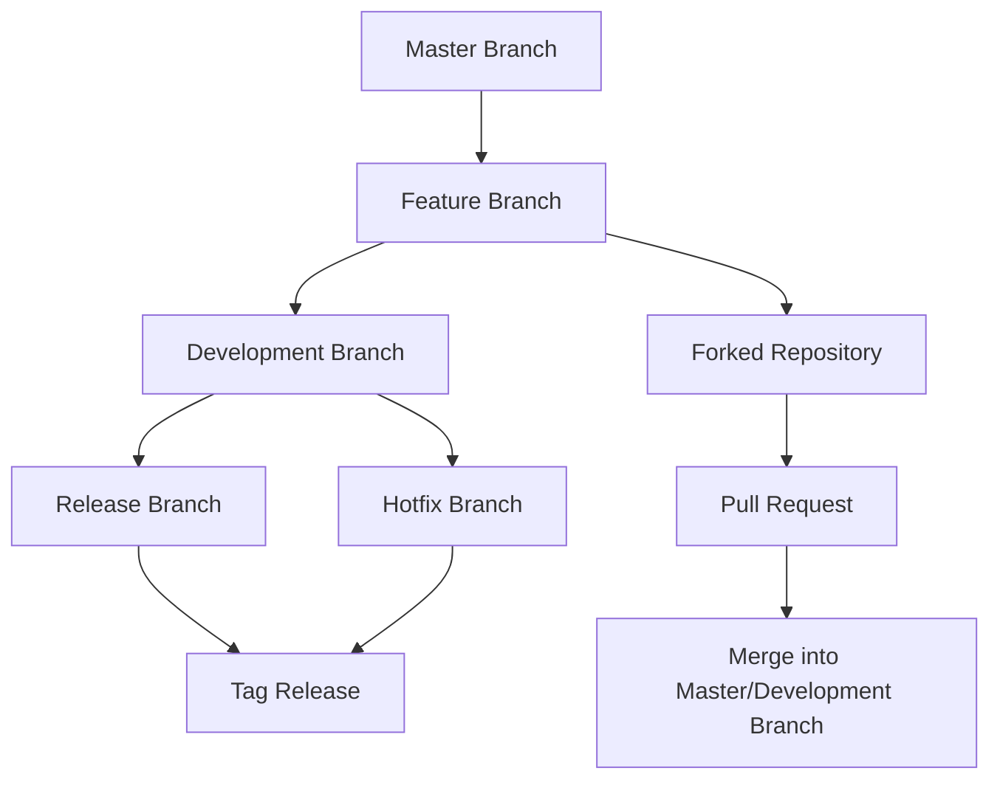

# Title of RFC

| Status        | (Proposed / Accepted / Implemented / Obsolete)       |
:-------------- |:---------------------------------------------------- |
| **RFC PR #**     |  |
| **Author(s)** | Sumesh Kaariyil (sumesh.pk@aot-technologies.com) |

## Objective

## Motivation

## Proposal

